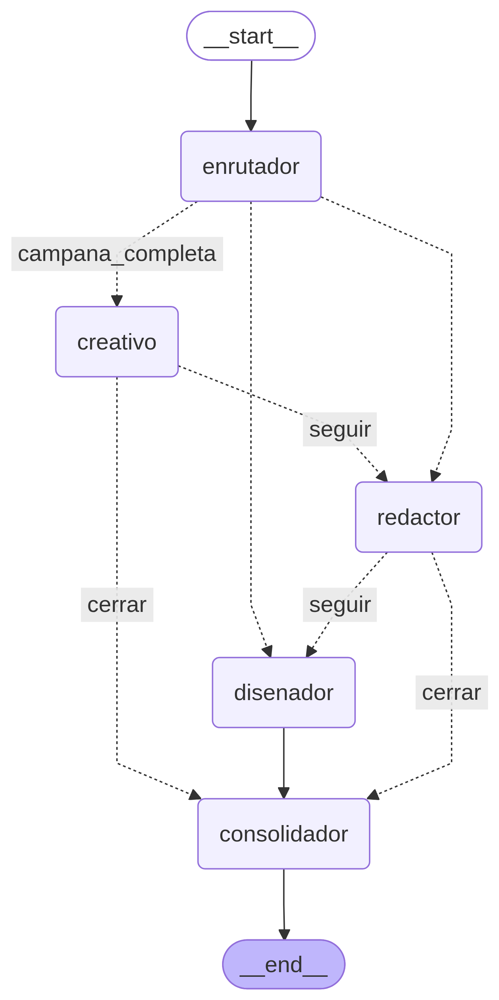
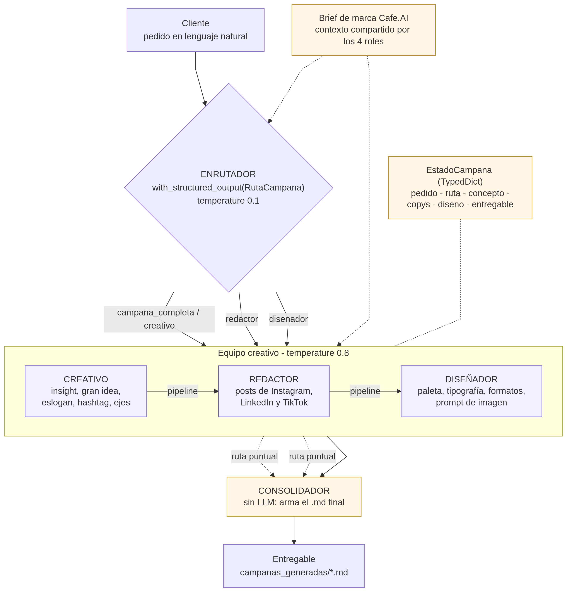

# Equipo publicitario multiagente para Cafe.AI

**Tarea bonus — Sesión 15 (Módulo 5: LangGraph y sistemas multiagente)**

## De qué iba el encargo

Cafe.AI es un café de barrio donde la tecnología y el sabor convergen: conexión rápida, café excepcional y un ambiente pensado para innovadores, desarrolladores y soñadores. Está por abrir y necesita su primera campaña en redes sociales.

Lo que había que hacer, usando el código que vimos en clase, era armar el equipo publicitario que se encarga de esa campaña, con cuatro roles: un enrutador, un creativo, un redactor y un diseñador.

Abrí el lab `campanapub.ipynb` esperando encontrar algo empezado y me encontré con dos celdas: el enunciado y la conexión al modelo. Todo lo demás quedaba por decidir, así que lo primero fue volver a los ejemplos de la sesión para elegir sobre cuál construir.

## La primera versión, y por qué la descarté

El candidato natural era el ejemplo de *routing* que vimos en `intro.ipynb`, y que también está en `sol/maslc.py`: se clasifica la entrada y se manda a un especialista, ese especialista responde, y ahí termina el grafo. Es limpio y calzaba de inmediato con los cuatro roles del enunciado.

Cuando lo dibujé en papel me di cuenta de que no servía. Si copiaba ese patrón tal cual, el enrutador iba a mandar el pedido al creativo, o al redactor, o al diseñador, y con esa única respuesta se acababa la corrida. Eso nunca iba a producir una campaña. Una campaña no es una respuesta suelta: el redactor necesita el concepto del creativo para escribir en la misma línea, y el diseñador necesita el concepto y además los textos, porque el arte tiene que conversar con lo que dice el post. Si cada rol trabaja aislado, salen tres piezas que no se parecen entre sí.

Así que me quedé con el enrutador de clase, pero cambié lo que pasa después de él.

## Cómo quedó el equipo

Es un grafo de LangGraph donde cada rol es un nodo. El enrutador lee el pedido del cliente en lenguaje natural, decide quién lo atiende, y de ahí el trabajo va pasando por el grafo hasta un consolidador que arma el documento final.



Ese diagrama no lo dibujé yo: sale de `equipo_publicitario.get_graph().draw_mermaid_png()`, o sea que es el grafo real, tal como LangGraph lo compiló.

La diferencia con el ejemplo de clase es que mi enrutador distingue dos tipos de pedido. Si el cliente pide la campaña completa ("necesitamos la campaña de lanzamiento para redes"), el grafo encadena creativo, redactor y diseñador, y cada uno recibe lo que produjo el anterior. Si el pedido es puntual ("solo dame los copys, ya tenemos el concepto"), va directo a ese rol y cierra ahí.

Me gustó esa solución porque es lo que pasa en una agencia de verdad: el cliente que llega con el encargo completo activa a todo el equipo, y el que llega con un pedido chico ocupa solo a quien corresponde. Cuando el pedido es ambiguo, la ruta por defecto es la campaña completa; prefiero entregar de más que de menos.

Lo que hace posible las dos rutas, en código, es que después del creativo y del redactor hay una compuerta (`add_conditional_edges`) que pregunta si esto era una campaña o un pedido puntual. Si era puntual, corta el pipeline y salta al consolidador.

## Qué hace cada rol

| Rol | Qué recibe | Qué entrega |
|---|---|---|
| **Enrutador** | El pedido del cliente | Una de cuatro rutas, más el motivo de la decisión |
| **Creativo** (director creativo) | El pedido y el brief de marca | *Insight*, gran idea, eslogan, hashtag, tono y tres ejes de contenido |
| **Redactor** (*copywriter*) | El concepto del creativo | Los posts de Instagram, LinkedIn y TikTok: gancho, texto, **CTA** (*Call To Action*, llamado a la acción) y hashtags |
| **Diseñador** (director de arte) | El concepto y los copys | Concepto visual, paleta con códigos hexadecimales, tipografía, composición, formatos por red y el prompt de imagen |

Hay un quinto nodo que no es un rol publicitario sino plomería: el consolidador, que junta lo que produjo la ruta recorrida y arma el documento final. A propósito no llama al modelo. Es el mismo criterio del `synthesizer` del ejemplo orquestador-*workers* de `intro.ipynb`: pegar texto que ya está generado es trabajo determinístico, y volver a pasarlo por el modelo solo agrega latencia y el riesgo de que lo reescriba o se coma un pedazo.

Los cuatro roles comparten el brief de marca (`brief_cafeai.py`), que en los términos de la arquitectura multiagente de la sesión hace de *Knowledge Base*: el contexto común que evita que el creativo hable de un café y el diseñador dibuje un bar.



## El diseñador, y un límite que preferí decir de frente

Acá me trabé un rato. Un **LLM** (*Large Language Model*, modelo de lenguaje de gran escala) de texto no genera imágenes, y el enunciado pedía un diseñador. Podía hacer que el rol escribiera algo que sonara a diseño y dejarlo pasar, pero eso hubiera sido vender humo.

Lo que hice fue que entregue lo que sí es accionable sin salir del texto: la especificación de arte completa (qué se ve, con qué colores, en qué tipografía, dónde va el logo, en qué proporción para cada red) y además un prompt listo para pegar en un generador de imágenes. Con eso la pieza se puede producir de verdad; la generación de la imagen queda como el paso siguiente, con una herramienta que sirva para eso.

## Cómo se corre

```bash
python campana_cafeai.py                                    # campaña completa (pedido de ejemplo)
python campana_cafeai.py "Solo necesito los copys para Instagram"
python campana_cafeai.py --grafo                            # exporta el diagrama del grafo
AGENT_MODEL=claude python campana_cafeai.py                 # cambia el backend de modelo
```

El modelo por defecto es `llama3.2` en Ollama, que es el que trae el lab. La resolución del backend está aislada en `_utils.py`, el mismo patrón que ya había usado en el `lab_equipo_editorial` de la Sesión 14, así que puedo conmutar entre Ollama, LM Studio o Claude con una variable de entorno y sin tocar una sola línea del grafo ni de los agentes.

Cada corrida deja su entregable en `campanas_generadas/`, con el pedido, la ruta que tomó el equipo y el modelo usado en la cabecera.

## Lo que pasó al correrlo

Probé los cuatro caminos del grafo con `llama3.2` local, y el enrutador acertó en los cuatro:

| Pedido | Ruta que eligió | Nodos que corrieron |
|---|---|---|
| *"Necesitamos la primera campaña de lanzamiento de Cafe.AI para redes sociales, con concepto, textos y arte"* | `campana_completa` | creativo → redactor → diseñador → consolidador |
| *"Solo necesito los copys para Instagram, ya tenemos el concepto"* | `redactor` | redactor → consolidador |
| *"Dame ideas y un eslogan para el lanzamiento"* | `creativo` | creativo → consolidador |
| *"Necesito la paleta de colores y el arte del post"* | `disenador` | diseñador → consolidador |

La campaña completa tardó 35 segundos de punta a punta en mi máquina, que son tres llamadas encadenadas al modelo local. Las rutas puntuales, al correr un solo rol, salen bastante más rápido.

Un pedazo de lo que salió en la campaña completa (`campanas_generadas/campana_llama3.2_20260831_004232.md`):

> **Insight** — La creatividad florece en espacios que fomentan el diálogo y la innovación.
> **Gran idea** — Cafe.AI: Conecta, Crea, InnovA.
> **Eslogan** — "Un café con una mente abierta"
> **Hashtag** — #CafeAI

El notebook `campanapub_resuelto.ipynb` está entregado con las salidas ya ejecutadas, así que se puede leer la corrida completa sin volver a correrlo.

## Qué funcionó y qué no

Lo que mejor anduvo fue el enrutador, y me sorprendió, porque `llama3.2` tiene 3 mil millones de parámetros y corre en mi propia máquina. Aun así clasificó las cuatro rutas sin equivocarse ni una vez. Pensándolo bien tiene sentido: clasificar es mucho más fácil que generar, y el `Literal` de Pydantic dentro de `with_structured_output` no le deja margen para inventarse una respuesta con otra forma. Es el mismo truco del `MessageClassifier` de `maslc.py`.

Donde sí se nota el modelo chico es en la generación. Los tres roles cumplen el encargo, pero se salen del formato que les pedí: escriben `**Instagram**` en vez de `## Instagram`, agregan preámbulos que expresamente les prohibí ("Espero que esta propuesta sea de su agrado"), y el diseñador me devolvió el prompt de imagen en español cuando lo había pedido en inglés. En una corrida terminó describiendo un bar con velas encendidas en vez de un café con laptops.

Lo que quiero dejar claro es que nada de eso es un problema del grafo. En las cuatro corridas el enrutador clasificó bien, el pipeline se encadenó en el orden correcto, el redactor recibió el concepto del creativo, el diseñador recibió los dos insumos, y el consolidador armó el documento. Lo que falla es la calidad del texto que produce un modelo de ese tamaño, y eso se arregla cambiando de backend, no de arquitectura. Por eso dejé el modelo conmutable: con Claude, o con Gemma vía LM Studio, el mismo grafo entrega piezas bastante más publicables. Es algo que ya había medido en `TESTING_MODELOS_EQUIPO_EDITORIAL.md` de la Sesión 14, donde `llama3.2` fue justamente el que se saltaba pasos del flujo.

## Lo que le agregaría

Un quinto rol evaluador, que revise las piezas contra el brief y devuelva el trabajo al redactor si el copy inventó precios, promociones u horarios que la marca nunca aprobó. Es el patrón *evaluator-optimizer* de `intro.ipynb` (generar, evaluar, volver a generar con el feedback), y es exactamente la pieza que le falta a este equipo para funcionar sin que yo revise cada salida.

## Archivos de la entrega

- `campanapub_resuelto.ipynb` — el lab de clase resuelto, con las salidas de la corrida real.
- `campana_cafeai.py` — el equipo completo como script ejecutable.
- `brief_cafeai.py` — el brief de marca que comparten los cuatro roles.
- `_utils.py` — resolución del backend de modelo (Ollama / LM Studio / Claude).
- `grafo_equipo_publicitario.png` — el grafo real, exportado desde LangGraph.
- `arquitectura_equipo_publicitario.png` — el diagrama de arquitectura del equipo.
- `campanas_generadas/` — las campañas que produjeron las corridas de prueba.
