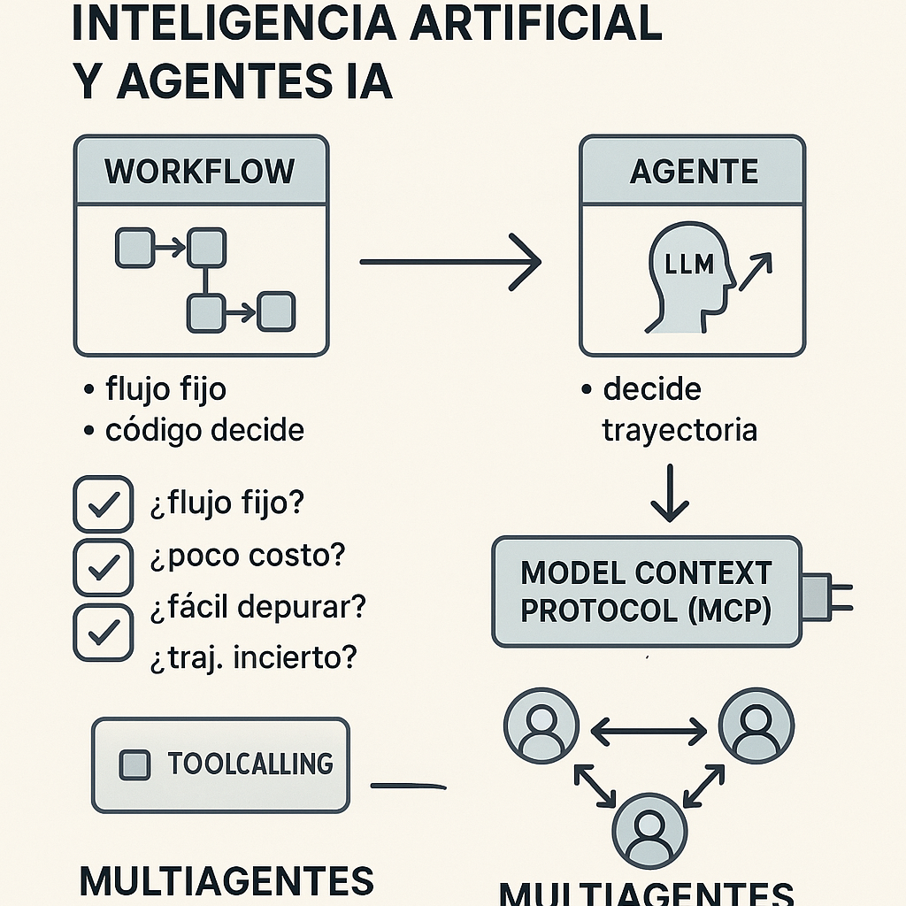

# Diferencias entre Workflow y Agente en IA
- **Fecha:** no especificada
- **Resumen:** En esta sesión se revisan las diferencias entre un workflow y un agente, así como la importancia del toolcalling y el Model Context Protocol (MCP). Se discuten las ventajas de cada enfoque y se presentan consideraciones para decidir cuándo utilizar un workflow o un agente. Además, se exploran las configuraciones de multiagentes para resolver problemas complejos.
- **Conceptos clave:**
  - Workflow
  - Agente
  - Toolcalling
  - Model Context Protocol (MCP)
  - Multiagentes
- **Conexión con otras sesiones del programa:** Se menciona la relación entre los conceptos de workflow y agente, así como la importancia del toolcalling y MCP en el contexto de la IA.

## Imagen conceptual
