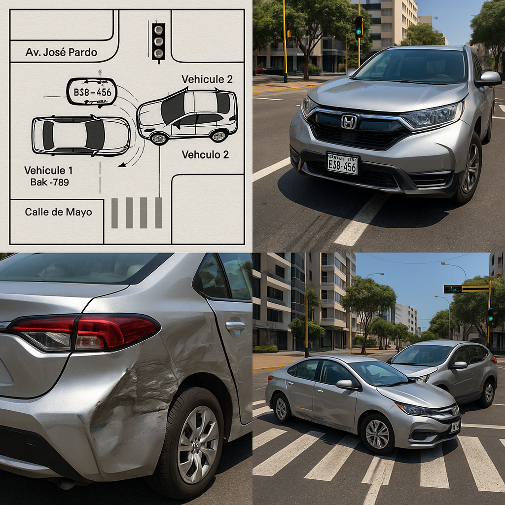

# Reporte de Siniestro N.º 00012025

## 1. Datos Generales del Incidente
- **ID de caso:** 00012025  
- **Fecha:** 30 de octubre de 2025  
- **Hora:** 10:15 a.m.  
- **Lugar:** Intersección de la Av. José Pardo con la Calle 2 de Mayo, distrito de Miraflores, Lima.  
- **Entorno:** Vía urbana con semáforos en funcionamiento. Día soleado, sin lluvia. Tráfico moderado. Calzada seca.  

## 2. Croquis del Accidente
A continuación se presenta el croquis generado en base a la información disponible del siniestro:

**Descripción del croquis:**  
- Intersección Av. José Pardo (eje principal oeste-este) con Calle 2 de Mayo (eje sur-norte).  
- **Vehículo 1 (Auto Toyota Corolla, placa B2K-789):** circulaba por Av. José Pardo en sentido oeste → este, por el carril derecho, con luz verde según versión de conductora y testigos.  
- **Vehículo 2 (Camioneta Honda CR-V, placa E5G-456):** circulaba por Calle 2 de Mayo en sentido sur → norte.  
- El impacto se produce en el **cuadrante noreste** de la intersección: la parte frontal de la camioneta colisiona contra el lateral derecho delantero y puerta del auto.  
- Se aprecian **marcas de frenado cortas** de la camioneta previas a la línea de cruce peatonal de Calle 2 de Mayo.  
- Posición final estimada: auto girado levemente hacia la izquierda tras el impacto; camioneta detenida parcialmente dentro de la intersección, orientada sur → norte.  

## 3. Vehículo y Conductor 1 (Auto)
- **Conductor:** Ana María Rojas Cáceres  
- **Documento de identidad:** 47852136-E  
- **Domicilio:** Calle Cantuarias 150, Miraflores, Lima  
- **Teléfono:** 987 654 321  
- **Licencia de conducir:** Categoría A-1, N.º 12345678, vigencia hasta 2030.  

**Vehículo:**  
- Tipo: Auto sedán  
- Marca / Modelo: Toyota Corolla  
- Año de fabricación: 2020  
- Placa: B2K-789  

**Daños reportados:**  
- Daño severo en la parte lateral derecha delantera.  
- Daño en puerta derecha delantera.  

**Información del seguro:**  
- Compañía: Pacífico Seguros  
- N.º de Póliza: 0123456789  
- SOAT: Vigente  
  - Compañía: La Positiva  
  - N.º SOAT: 9876543210  

## 4. Vehículo y Conductor 2 (Camioneta)
- **Conductor:** Juan Carlos Pérez Soto  
- **Documento de identidad:** 40125874-C  
- **Domicilio:** Av. Comandante Espinar 550, Miraflores, Lima  
- **Teléfono:** 999 888 777  
- **Licencia de conducir:** Categoría A-3, N.º 87654321, vigencia hasta 2029.  

**Vehículo:**  
- Tipo: Camioneta SUV  
- Marca / Modelo: Honda CR-V  
- Año de fabricación: 2022  
- Placa: E5G-456  

**Daños reportados:**  
- Daño moderado en la parte frontal (parachoques y capó).  

**Información del seguro:**  
- Compañía: Rímac Seguros  
- N.º de Póliza: 0987654321  
- SOAT: Vigente  
  - Compañía: Rímac Seguros  
  - N.º SOAT: 1023456789  

## 5. Descripción Detallada del Suceso
De la información recabada en el parte inicial se tiene lo siguiente:

- El **Vehículo 1 (auto, B2K-789)** se desplazaba por la Av. José Pardo en sentido oeste → este, hacia el óvalo de Miraflores.  
- El **Vehículo 2 (camioneta, E5G-456)** circulaba por la Calle 2 de Mayo en sentido sur → norte.  
- La colisión se produce en el cuadrante noreste de la intersección, cuando la camioneta ingresa al cruce y su parte frontal impacta el costado derecho delantero del auto.

### Versión de la conductora del Vehículo 1 (Sra. Ana María Rojas)
La Sra. Rojas indica que circulaba por la Av. José Pardo con **luz verde** del semáforo a su favor. Manifiesta que, mientras continuaba su marcha a velocidad moderada, la camioneta conducida por el Sr. Pérez cruzó la intersección **sin respetar la señal** de tránsito, invadiendo su trayectoria y provocando la colisión. Señala que no tuvo tiempo suficiente para realizar una maniobra evasiva.

### Versión del conductor del Vehículo 2 (Sr. Juan Carlos Pérez)
El Sr. Pérez refiere que se aproximaba a la intersección por la Calle 2 de Mayo y que el semáforo cambió a **ámbar** cuando estaba cerca de la línea de pare. Indica que intentó frenar, pero no lo hizo con la anticipación suficiente, por lo que decidió continuar el cruce. Al ingresar al cruce se produjo el impacto con el auto que venía por la Av. José Pardo.

## 6. Testigos
- **Testigo 1: Roberto Gutiérrez (45 años)**  
  - Ubicación: Se encontraba en la vereda de la esquina de la intersección.  
  - Declaración: Manifiesta que el auto conducido por la Sra. Rojas tenía **luz verde** y que la camioneta de color negro (Honda CR-V) **pasó el semáforo en luz roja**.

- **Testigo 2: Laura Mendoza (30 años)**  
  - Ubicación: Se encontraba en el paradero de bus cercano a la intersección.  
  - Declaración: Señala que la camioneta **intentó cruzar rápidamente** la intersección cuando el cambio de semáforo ya se había producido, confirmando una maniobra apresurada del Vehículo 2.

## 7. Autoridad Interviniente y Atención en el Lugar
- **Policía Nacional del Perú**  
  - Comisaría de Miraflores.  
  - Agente a cargo: Suboficial PNP Miguel Arcos.  
- **Serenazgo de Miraflores:** Acudió para controlar el tráfico y brindar apoyo inicial a los conductores.  
- **Atención médica:** No se requirió el traslado de los involucrados por emergencias; solo se registraron daños materiales.  
  - La Sra. Rojas presentó **contusión leve en el hombro**, pero se negó al traslado a un centro médico, manifestando que acudiría luego por sus propios medios si persistían las molestias.

## 8. Daños y Afectaciones
- **Daños materiales Vehículo 1:**  
  - Lateral derecho delantero con deformación severa.  
  - Puerta delantera derecha afectada (posible sustitución).  

- **Daños materiales Vehículo 2:**  
  - Parachoques delantero con deformación.  
  - Capó con abolladuras moderadas.  

- **Daños personales:**  
  - Sin heridos de gravedad reportados en el lugar.  
  - Contusión leve referida por la Sra. Rojas (sin atención médica inmediata en el sitio).

## 9. Situación Legal y Procedimental
- Se levantó el **atestado policial** correspondiente en la Comisaría de Miraflores.  
- Ambos vehículos fueron **trasladados a la comisaría** para continuar con las investigaciones y peritajes técnicos.  
- **No se emitieron multas en el lugar** del accidente; la determinación de responsabilidades quedó sujeta al resultado de las investigaciones policiales y a los peritajes de tránsito.  
- Ambos conductores **notificaron a sus compañías de seguros** (Pacífico Seguros y Rímac Seguros) para el inicio de sus respectivos procesos de reclamación por daños materiales.

## 10. Análisis Preliminar de Responsabilidad (a nivel descriptivo)
Con base en:
- La versión de los conductores.  
- Las declaraciones de los testigos independientes.  
- La dinámica del impacto (frontal de camioneta vs. lateral derecho del auto).  
- La ubicación del impacto (cuadrante noreste de la intersección).  

Se aprecia, de manera **preliminar y descriptiva**, lo siguiente:

1. El **Vehículo 1** se encontraba circulando por la vía principal (Av. José Pardo) con semáforo presuntamente en **luz verde**, de acuerdo a la conductora y al Testigo 1.  
2. El **Vehículo 2** se aproximó al cruce por Calle 2 de Mayo, refiriendo haber ingresado con semáforo en **ámbar**, sin embargo, el Testigo 1 afirma que lo hizo con **luz roja**, y el Testigo 2 refuerza la percepción de una maniobra apresurada para “ganar” el cruce.  
3. La naturaleza del daño (frontal de la camioneta contra el lateral del auto) sugiere que el auto ya se encontraba avanzando por la intersección cuando la camioneta ingresó a la misma.  

Esta apreciación es **referencial** y queda sujeta a la conclusión final del atestado policial, los peritajes técnicos de tránsito y las políticas de evaluación de responsabilidad de la aseguradora.

## 11. Notas Adicionales
- No se reportaron daños a infraestructura pública (semáforos, postes, señalización u otros) en el parte inicial.  
- Se recomienda a las partes conservar la documentación original del atestado policial, fotografías y presupuestos de reparación para la correcta tramitación de los reclamos de seguro.

---

**Fin del reporte de siniestro N.º 00012025**
