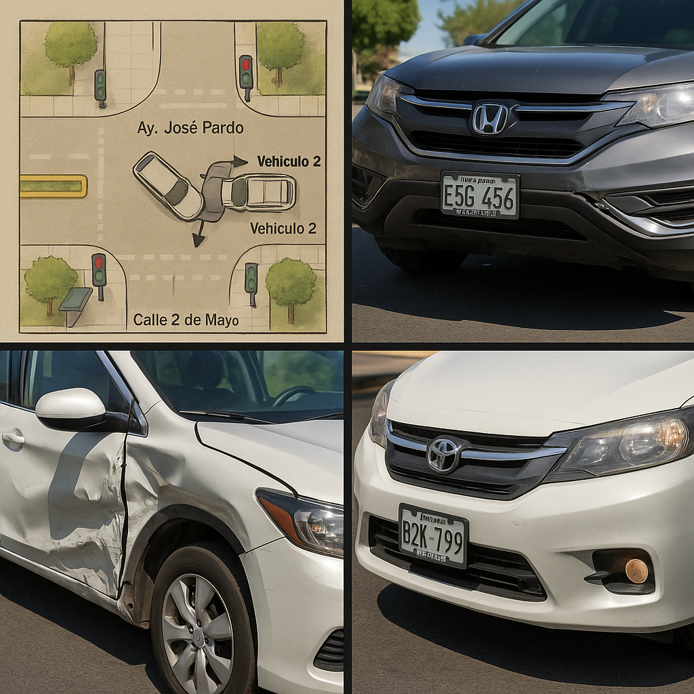

# Reporte de Siniestro

**ID de Caso:** 00012025  
**Fecha del incidente:** 30 de octubre de 2025  
**Hora:** 10:15 a.m.  
**Lugar:** Intersección de la Av. José Pardo con la Calle 2 de Mayo, Miraflores, Lima  

---

## 1. Descripción General del Incidente

Intersección urbana con semáforos en funcionamiento, día soleado, sin lluvia, con tráfico moderado.  

El Vehículo 1 (auto sedán Toyota Corolla, placa B2K-789) circulaba por la Av. José Pardo en dirección al óvalo de Miraflores.  
El Vehículo 2 (camioneta SUV Honda CR-V, placa E5G-456) circulaba por la Calle 2 de Mayo, cruzando la intersección.  

La colisión se produjo en el cuadrante noreste de la intersección, impactando la parte lateral derecha delantera del Vehículo 1 y la parte frontal del Vehículo 2.

---

## 2. Croquis del Accidente

Descripción del croquis:
- Vista cenital de la intersección Av. José Pardo (eje horizontal) con Calle 2 de Mayo (eje vertical).  
- Vehículo 1: Auto Toyota Corolla, placa B2K-789, desplazándose de izquierda a derecha por Av. José Pardo.  
- Vehículo 2: Camioneta Honda CR-V, placa E5G-456, desplazándose de abajo hacia arriba por Calle 2 de Mayo.  
- Punto de impacto en el cuadrante noreste de la intersección.  
- Semáforos en las cuatro esquinas, representando luz verde para el sentido de circulación del Vehículo 1 y luz roja para el sentido de circulación del Vehículo 2.  
- Vía seca, día soleado.  
- Veredas, árboles en esquinas y paradero de bus en la esquina suroeste.

---

## 3. Datos del Vehículo y Conductor 1 (Auto)

**Conductor:** Ana María Rojas Cáceres  
**Documento de identidad:** 47852136-E  
**Domicilio:** Calle Cantuarias 150, Miraflores, Lima  
**Teléfono:** 987 654 321  
**Licencia de conducir:** A-1, N° 12345678, Vigente hasta 2030  

**Vehículo:** Auto sedán, marca Toyota, modelo Corolla, año 2020  
**Placa:** B2K-789  
**Daños:** Daño severo en la parte lateral derecha delantera y puerta.  

**Información del seguro:**  
- Compañía: Pacífico Seguros  
- N° de Póliza: 0123456789  
- SOAT: Vigente (Compañía La Positiva, N° 9876543210)

---

## 4. Datos del Vehículo y Conductor 2 (Camioneta)

**Conductor:** Juan Carlos Pérez Soto  
**Documento de identidad:** 40125874-C  
**Domicilio:** Av. Comandante Espinar 550, Miraflores, Lima  
**Teléfono:** 999 888 777  
**Licencia de conducir:** A-3, N° 87654321, Vigente hasta 2029  

**Vehículo:** Camioneta SUV, marca Honda, modelo CR-V, año 2022  
**Placa:** E5G-456  
**Daños:** Daño moderado en la parte frontal (parachoques y capó).  

**Información del seguro:**  
- Compañía: Rímac Seguros  
- N° de Póliza: 0987654321  
- SOAT: Vigente (Compañía Rímac Seguros, N° 1023456789)

---

## 5. Versión de los Hechos

**Versión de la conductora del Vehículo 1 (Ana María Rojas):**  
Indica que circulaba por la Av. José Pardo con luz verde a su favor. Señala que la camioneta conducida por el Sr. Pérez cruzó la intersección sin respetar la señal de tránsito (semáforo en rojo), impactando contra su vehículo y ocasionando daños materiales severos en la parte lateral derecha delantera.

**Versión del conductor del Vehículo 2 (Juan Carlos Pérez):**  
Manifiesta que cruzó la intersección cuando el semáforo se encontraba en luz ámbar y que no logró detener la marcha a tiempo, produciéndose así la colisión con el Vehículo 1.

---

## 6. Testigos

**Testigo 1: Roberto Gutiérrez (45 años)**  
Ubicación: Vereda de la esquina próxima a la intersección.  
Declaración: Afirmó que el auto de la Sra. Rojas tenía la luz verde y que la camioneta de color negro pasó el semáforo en rojo.

**Testigo 2: Laura Mendoza (30 años)**  
Ubicación: Paradero de bus cercano a la intersección (esquina suroeste).  
Declaración: Confirmó que la camioneta intentó cruzar rápidamente la intersección, sin detenerse, en el momento previo a la colisión.

---

## 7. Autoridad Interviniente y Atención Inicial

**Policía Nacional del Perú**  
Comisaría: Miraflores  
Agente a cargo: Suboficial PNP Miguel Arcos  

**Atención de Emergencia:**  
Personal de Serenazgo de Miraflores acudió al lugar para controlar el tráfico y asistir a los implicados.  
No se requirió atención médica de emergencia; solo se registraron daños materiales.

---

## 8. Lesiones Reportadas

- La Sra. Ana María Rojas presentó una contusión leve en el hombro.  
- La conductora se negó al traslado a un centro médico, manifestando que se encontraba estable.  
- No se reportaron otras lesiones de consideración al momento del levantamiento de la información.

---

## 9. Actuaciones Posteriores

- Se levantó el atestado policial correspondiente en la Comisaría de Miraflores.  
- Ambos vehículos fueron trasladados a la comisaría para las investigaciones de rutina.  
- No se emitieron multas en el lugar del accidente; la responsabilidad se determinará en el proceso de investigación posterior.  
- Ambos conductores notificaron a sus respectivas compañías de seguros para el inicio del proceso de reclamo.

---

## 10. Observaciones para Evaluación del Siniestro

- La **coincidencia de testimonios** (conductora del Vehículo 1 y testigo 1) apunta a un posible **incumplimiento de la luz roja del semáforo** por parte del Vehículo 2.  
- La declaración del conductor del Vehículo 2 reconoce el cruce con luz ámbar y la imposibilidad de detenerse a tiempo, lo que podría ser considerado como **conducción imprudente** en una intersección semaforizada.  
- Las condiciones de la vía (seca, día soleado, visibilidad adecuada) no constituyen factores que justifiquen una pérdida de control por factores externos.

**Recomendación:**  
Registrar el presente evento como **caso de siniestro con daños materiales predominantes**, manteniendo en observación la evolución de cualquier reporte médico posterior relacionado con la contusión de la Sra. Rojas.  
Queda pendiente la determinación formal de responsabilidad por parte de la autoridad competente y el ajuste definitivo por parte de Calma S.A.
