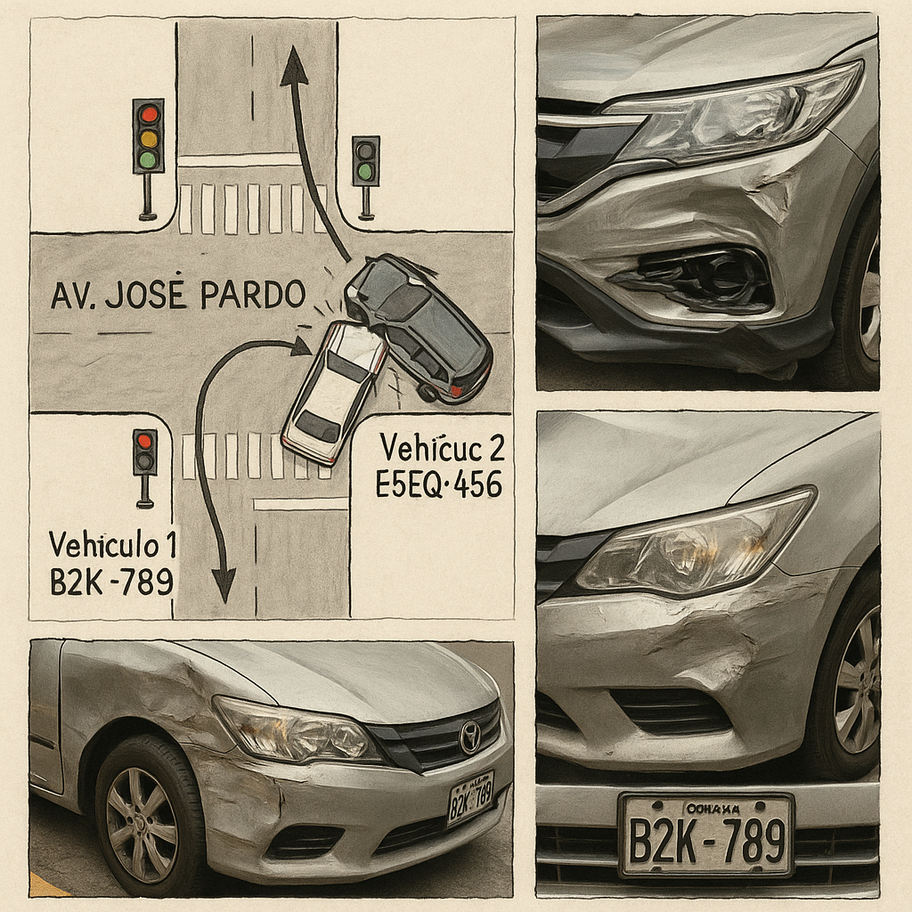

# Reporte de Siniestro N° 00012025

## 1. Datos Generales del Incidente
- **Fecha:** 30 de octubre de 2025  
- **Hora:** 10:15 a.m.  
- **Lugar:** Intersección de la Av. José Pardo con la Calle 2 de Mayo, Miraflores, Lima.  
- **Descripción del entorno:** Vía urbana con semáforos en funcionamiento, día soleado, sin lluvia, tráfico moderado.  

## 2. Croquis del Accidente
A continuación se presenta la representación gráfica esquemática de la escena del accidente, elaborada en base a la información recopilada del parte policial, declaraciones de los conductores y testigos:

**Descripción del croquis:**  
- Intersección de la **Av. José Pardo** (sentido oeste → este, hacia el óvalo de Miraflores) con la **Calle 2 de Mayo** (sentido sur → norte).  
- **Vehículo 1 (Auto Toyota Corolla, placa B2K-789)** circula por Av. José Pardo con luz verde a su favor, por el carril derecho.  
- **Vehículo 2 (Camioneta Honda CR‑V, placa E5G-456)** circula por Calle 2 de Mayo en sentido sur–norte e ingresa al cruce cuando el semáforo se encontraba en fase ámbar/roja.  
- El **punto de impacto** se ubica en el **cuadrante noreste de la intersección**, produciéndose un choque del frontal de la camioneta contra el lateral derecho delantero del auto.  
- Se observan en el croquis: semáforos en cada esquina, cruce peatonal marcado y señalización de sentidos de circulación.

## 3. Vehículo y Conductor 1 (Auto)
- **Conductor:** Ana María Rojas Cáceres  
- **Documento de identidad:** 47852136-E  
- **Domicilio:** Calle Cantuarias 150, Miraflores, Lima  
- **Teléfono:** 987 654 321  
- **Licencia de conducir:** Categoría A-1, N° 12345678 (vigente hasta 2030)  

**Datos del vehículo:**  
- Tipo: Auto sedán  
- Marca / Modelo: Toyota Corolla  
- Año de fabricación: 2020  
- Placa: B2K-789  
- **Daños reportados:** Daño severo en la parte lateral derecha delantera y puerta (afectación de panel lateral, posible daño en sistema de suspensión y alineamiento).  

**Seguro y SOAT:**  
- Aseguradora: **Pacífico Seguros**  
- N° de Póliza: 0123456789  
- SOAT: Vigente – Compañía **La Positiva**, N° 9876543210  

## 4. Vehículo y Conductor 2 (Camioneta)
- **Conductor:** Juan Carlos Pérez Soto  
- **Documento de identidad:** 40125874-C  
- **Domicilio:** Av. Comandante Espinar 550, Miraflores, Lima  
- **Teléfono:** 999 888 777  
- **Licencia de conducir:** Categoría A-3, N° 87654321 (vigente hasta 2029)  

**Datos del vehículo:**  
- Tipo: Camioneta SUV  
- Marca / Modelo: Honda CR‑V  
- Año de fabricación: 2022  
- Placa: E5G-456  
- **Daños reportados:** Daño moderado en la parte frontal (parachoques y capó, posible afectación de radiador y componentes frontales).  

**Seguro y SOAT:**  
- Aseguradora: **Rímac Seguros**  
- N° de Póliza: 0987654321  
- SOAT: Vigente – Compañía **Rímac Seguros**, N° 1023456789  

## 5. Descripción Detallada del Suceso
Según la información recopilada en el lugar del accidente y las versiones de los implicados:

- La **Sra. Ana María Rojas** conducía el auto Toyota Corolla por la **Av. José Pardo en sentido oeste–este**, manifestando que avanzaba con **luz verde** del semáforo a su favor. Indica que mantenía una velocidad moderada acorde con la vía urbana.  
- El **Sr. Juan Carlos Pérez**, al mando de la camioneta Honda CR‑V, circulaba por la **Calle 2 de Mayo en sentido sur–norte**. Señala que ingresó a la intersección cuando el semáforo cambió a **luz ámbar**, sin lograr detener el vehículo antes de la línea de detención.  
- La colisión se produjo en el **cuadrante noreste de la intersección**, impactando la parte frontal de la camioneta contra el **lateral derecho delantero** del auto, generando el giro parcial del auto hacia su izquierda por efecto del impacto.  
- No se reportan otros vehículos directamente involucrados ni obstrucciones de la vía distintas al flujo regular del tránsito.

## 6. Testigos

- **Testigo 1:** Roberto Gutiérrez, 45 años.  
  - Ubicación al momento del hecho: vereda de la esquina cercana a la intersección.  
  - Declaración: Afirma que el auto de la Sra. Rojas avanzaba con **luz verde** del semáforo y que la camioneta de color negro (Honda CR‑V) **cruzó con el semáforo en rojo**, ingresando a la intersección cuando ya no tenía prioridad de paso.  

- **Testigo 2:** Laura Mendoza, 30 años.  
  - Ubicación al momento del hecho: paradero de bus próximo a la esquina.  
  - Declaración: Indica que la camioneta **intentó cruzar rápidamente** la intersección cuando el semáforo estaba cambiando, sin reducir la velocidad, lo que derivó en el impacto con el auto que ya se encontraba cruzando.

## 7. Autoridad Interviniente y Atención Inicial
- **Policía Nacional del Perú – Comisaría de Miraflores**  
  - Agente a cargo: **Suboficial PNP Miguel Arcos**.  
- **Serenazgo de Miraflores:** Acudió al lugar para controlar el flujo vehicular, señalizar la zona del accidente y brindar apoyo a los involucrados.  
- **Atención médica:** No se requirió el traslado inmediato de los ocupantes a un centro de salud.  
  - La Sra. Rojas presentó **contusión leve en el hombro**, negándose al traslado médico, quedando constancia de ello en el parte.  

## 8. Entrevista en Medio de Comunicación
Se registró la existencia de un podcast noticioso local que cubrió el accidente. La transcripción completa de la entrevista relacionada con el caso ID 00012025 no se encuentra incorporada en este reporte al momento de su emisión. De ser requerida, podrá anexarse como **Anexo 1 – Transcripción de entrevista en podcast** una vez obtenida y validada.

## 9. Conclusiones Iniciales para Fines Aseguradores
1. Se trata de un **siniestro de colisión en intersección regulada por semáforos**, en zona urbana de Miraflores.  
2. De acuerdo con las declaraciones de los testigos y la versión de la conductora del vehículo 1, existirían indicios de que el **vehículo 2 (camioneta Honda CR‑V)** habría ingresado a la intersección **sin respetar la luz roja/ámbar del semáforo**, lo que habría sido el factor desencadenante del impacto.  
3. Los daños son **principalmente materiales** en ambos vehículos; se registra **lesión leve** en la conductora del vehículo 1 sin traslado médico.  
4. Ambos vehículos cuentan con **pólizas de seguro vigentes** y **SOAT vigente**, por lo que corresponde la **apertura y continuidad del trámite de siniestro** ante las aseguradoras involucradas.  
5. La determinación definitiva de responsabilidad quedará sujeta al **resultado del atestado policial** y a la eventual obtención de imágenes de cámaras de seguridad o mayor evidencia complementaria.

---

**Elaborado por:** Especialista en Siniestros – Calma S.A.  
**Fecha de elaboración del reporte:** 11 de agosto de 2026
