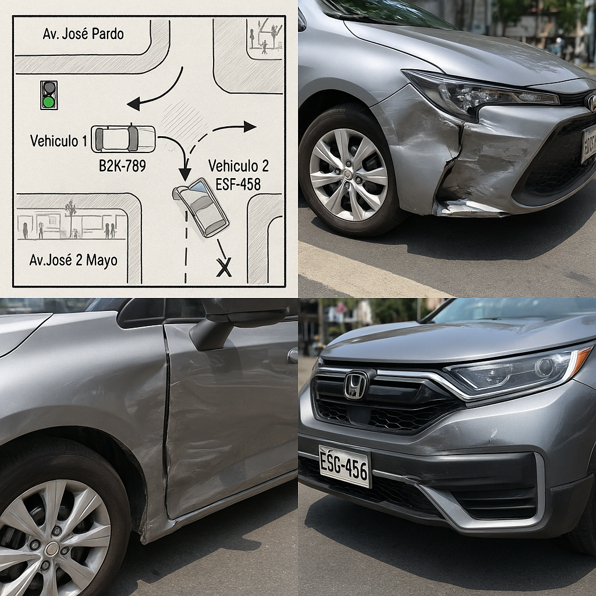

# Reporte de Siniestro N.º 00012025

## 1. Datos Generales del Incidente
- **Fecha:** 30 de octubre de 2025  
- **Hora:** 10:15 a.m.  
- **Lugar:** Intersección de la Av. José Pardo con la Calle 2 de Mayo, Miraflores, Lima.  
- **Entorno:** Vía urbana con semáforos en funcionamiento. Día soleado, sin lluvia, pavimento seco, tráfico moderado. Presencia de peatones en veredas y paradero de bus cercano.  

## 2. Croquis del Accidente

**Descripción del croquis:**  
- Intersección en “+” entre Av. José Pardo (eje oeste-este) y Calle 2 de Mayo (eje sur-norte).  
- **Vehículo 1 (Auto Toyota Corolla, placa B2K-789)** circula por Av. José Pardo en sentido oeste → este (hacia el óvalo de Miraflores).  
- **Vehículo 2 (Camioneta Honda CR-V, placa E5G-456)** circula por Calle 2 de Mayo en sentido sur → norte.  
- Punto de impacto ubicado en el **cuadrante noreste** de la intersección.  
- Zona de colisión: **frontal de la camioneta** contra el **lateral derecho delantero** del auto.  
- Semáforo de Av. José Pardo representado en **verde** para el auto y semáforo de Calle 2 de Mayo en **rojo** para la camioneta al momento del impacto, según versiones y testigos.  

## 3. Vehículo y Conductor 1 (Auto)
- **Conductor:** Ana María Rojas Cáceres  
- **Documento de identidad:** 47852136-E  
- **Domicilio:** Calle Cantuarias 150, Miraflores, Lima  
- **Teléfono:** 987 654 321  
- **Licencia de conducir:** A-1, N.º 12345678 (vigente hasta 2030)  

**Vehículo:**  
- Tipo: Auto sedán  
- Marca: Toyota  
- Modelo: Corolla  
- Año: 2020  
- **Placa:** B2K-789  

**Daños reportados:**  
- Daño severo en la parte lateral derecha delantera y puerta.  

**Información del seguro:**  
- Compañía: Pacífico Seguros  
- N.º de póliza: 0123456789  
- SOAT: Vigente (La Positiva, N.º 9876543210)  

## 4. Vehículo y Conductor 2 (Camioneta)
- **Conductor:** Juan Carlos Pérez Soto  
- **Documento de identidad:** 40125874-C  
- **Domicilio:** Av. Comandante Espinar 550, Miraflores, Lima  
- **Teléfono:** 999 888 777  
- **Licencia de conducir:** A-3, N.º 87654321 (vigente hasta 2029)  

**Vehículo:**  
- Tipo: Camioneta SUV  
- Marca: Honda  
- Modelo: CR-V  
- Año: 2022  
- **Placa:** E5G-456  

**Daños reportados:**  
- Daño moderado en la parte frontal (parachoques y capó).  

**Información del seguro:**  
- Compañía: Rímac Seguros  
- N.º de póliza: 0987654321  
- SOAT: Vigente (Rímac Seguros, N.º 1023456789)  

## 5. Descripción del Suceso
De acuerdo con la información recopilada en el lugar y versiones de los implicados:

- El **vehículo 1 (auto)** circulaba por la Av. José Pardo, en sentido oeste-este, manifestando su conductora que contaba con **luz verde** en el semáforo.  
- El **vehículo 2 (camioneta)** circulaba por la Calle 2 de Mayo, en sentido sur-norte. Su conductor indicó que ingresó a la intersección con el semáforo en **luz ámbar**, sin poder detenerse a tiempo.  
- La colisión se produjo en el **cuadrante noreste de la intersección**, impactando la parte frontal de la camioneta contra el lateral derecho delantero del auto.  
- No se presentaron factores climáticos adversos ni deficiencias aparentes en la vía que pudieran haber contribuido al accidente.  

## 6. Testigos
- **Testigo 1:** Roberto Gutiérrez (45 años).  
  - Ubicación: Vereda de la esquina.  
  - Declaración: Manifiesta que el auto de la Sra. Rojas avanzó con **luz verde** y que la camioneta, de color negro, **pasó el semáforo en rojo**.  

- **Testigo 2:** Laura Mendoza (30 años).  
  - Ubicación: Paradero de bus cercano.  
  - Declaración: Indica que la camioneta **intentó cruzar rápidamente** la intersección cuando el semáforo estaba por cambiar.  

## 7. Autoridad Interviniente y Atención en el Lugar
- **Policía Nacional del Perú:** Comisaría de Miraflores.  
  - Agente a cargo: Suboficial PNP Miguel Arcos.  
- **Serenazgo de Miraflores:** Acudió para control del tráfico y asistencia básica a los involucrados.  
- **Atención médica:**  
  - No se requirió traslado inmediato a centro médico.  
  - La Sra. Rojas presentó **contusión leve en el hombro** y se negó al traslado.  

## 8. Conclusiones y Notas para Calma S.A.
1. Se trata de un **siniestro de colisión en intersección regulada por semáforos**, con daños materiales relevantes en ambos vehículos y lesión leve no incapacitante en la conductora del vehículo 1.  
2. Los **testimonios de los testigos 1 y 2**, sumados a la declaración de la conductora del auto, coinciden en señalar que el vehículo 2 habría cruzado la intersección cuando ya no contaba con luz verde, presuntamente con el semáforo en rojo o en fase de cambio, lo que **indica posible inobservancia de la señal de tránsito** por parte del conductor de la camioneta.  
3. No se reportan factores externos (clima, estado de la vía) que contribuyan al accidente.  
4. Se levantó el atestado policial y los vehículos fueron trasladados a la comisaría de Miraflores para investigaciones complementarias y peritajes.  
5. Ambos conductores notificaron a sus respectivas compañías de seguros para el inicio de los procesos de reclamación.  

**Recomendación para la gestión del caso por Calma S.A.:**  
- Considerar este evento como **caso de siniestro cubierto** a efectos de la póliza correspondiente, sujeto a la verificación de cobertura vigente, revisión del atestado policial definitivo y eventuales peritajes que confirmen la responsabilidad principal del vehículo contrario (camioneta E5G-456).  
