# Guía paso a paso — Tarea "Physical AI Agent Interfaces" con ElevenLabs (SaaS)

> **Tarea original (Sesión 18):** Tipo grupal. Hacer una prueba de *Physical Agent Interfaces* con cualquier plataforma SaaS considerada para el proyecto, y documentar los hallazgos. **Fecha límite: 12/11.**
> **Restricción de este plan:** sin cámara (Tapo), sin parlante externo ni hardware dedicado. Todo se prueba con el micrófono y parlante integrados de la laptop, desde el navegador — eso ya satisface el requisito de la tarea, porque lo que se evalúa es el SaaS, no una integración física real.
> Esta guía se va completando con capturas reales a medida que avanzamos — cada paso marcado ✅ ya está hecho y documentado con imagen; los que siguen sin ✅ son los próximos.

---

## Qué agente vamos a construir

Un **Speech Agent** (agente conversacional de voz) usando el producto **ElevenLabs Conversational AI** (dentro de la plataforma **ElevenAgents**). A diferencia del laboratorio de la sesión (que arma manualmente STT → LLM → TTS con `fastrtc` + `moonshine` + `kokoro`), aquí el SaaS entrega el pipeline completo ya integrado:

- Tú defines una **persona** (system prompt: quién es el agente, cómo debe responder).
- Opcionalmente le das **una herramienta (tool)** que pueda invocar durante la conversación — esto prueba el patrón *tool call* de las diapositivas 6-8 del material (`FUNCTION` / `SEARCH` / `HANDOFF`).
- La plataforma resuelve el STT, el LLM y el TTS por ti.
- Pruebas el agente hablando por el micrófono del navegador y escuchando la respuesta por el parlante de tu laptop — sin ningún hardware adicional.

Usamos una **persona genérica de asistente personal** (agente en blanco, sin plantilla), con una sola tool simulada más adelante, para que el ejercicio no dependa de tu proyecto de gatos (que sí requeriría cámara real).

---

## Paso 1 — Elegir plataforma ✅

En el dashboard de ElevenLabs, al elegir plataforma:

**Elegido: ElevenAgents** (no ElevenCreative).

ElevenCreative es para generar contenido suelto (TTS/STT/doblaje individuales). ElevenAgents es donde vive el producto de agentes conversacionales completos: **Agents**, **Tools**, **Knowledge Base**, **Conversations**, **Phone numbers** — todo lo que necesitamos para armar y probar el Speech Agent.

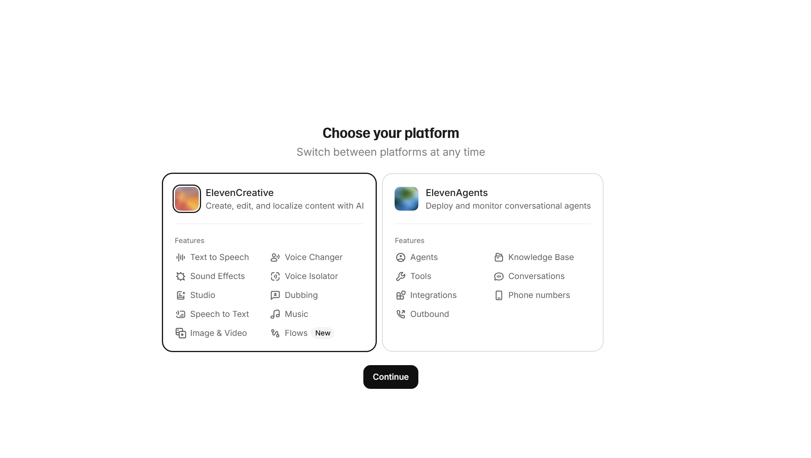

---

## Paso 2 — Perfil de uso ✅

Pantalla de onboarding "¿Cuál te describe mejor?".

**Elegido: Educación.**

Es solo para personalizar tips/ejemplos que muestra la plataforma — no afecta funcionalidad ni límites del free tier. Cualquier opción habría servido igual para la tarea.

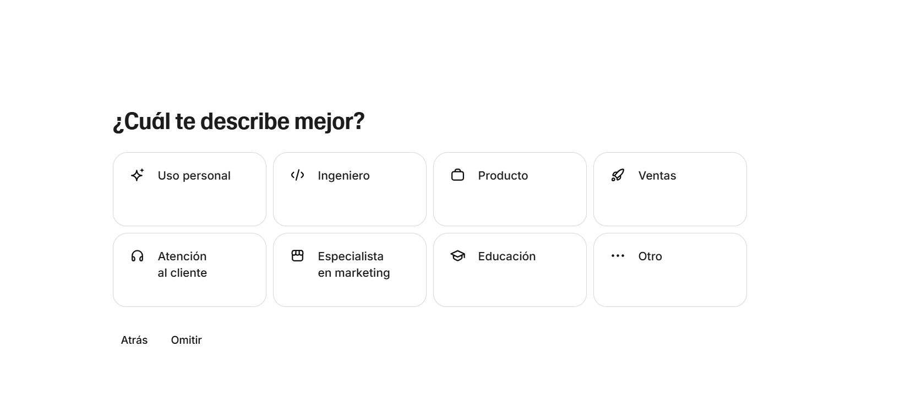

---

## Paso 3 — Tipo de agente a crear ✅

Pantalla "Bienvenido a ElevenAgents — ¿Qué tipo de agente te gustaría crear?", con dos plantillas (Asistente personal, Agente de negocios) y la opción de agente en blanco.

**Elegido: Agente en blanco.**

Las plantillas ya traen un *system prompt* y comportamiento predefinidos para otros casos de uso. Partir en blanco nos deja escribir directamente el *system prompt* propio del Paso 5 sin tener que desarmar nada.

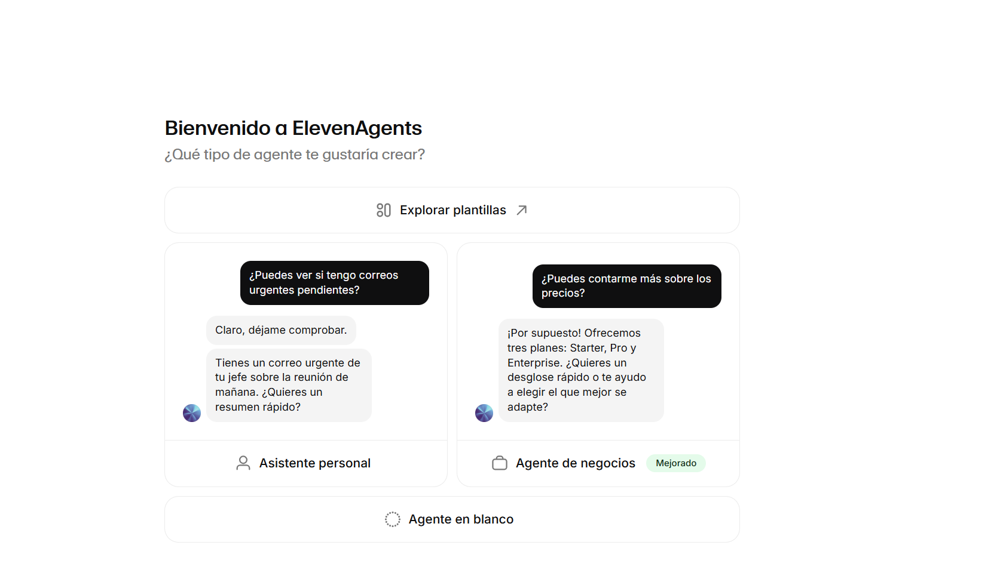

---

## Paso 4 — Nombre del agente y modo de entrada ✅

Pantalla "Completa tu agente".

- **Nombre:** `Agente-Prueba-Sesion18`
- **Toggle "Solo chat": desactivado (OFF).** Esto es importante — si se activa, el agente *solo* procesa texto y el audio queda deshabilitado, con lo cual perderíamos la parte de "interfaz física de voz" que exige la tarea. Lo dejamos apagado para que use micrófono/voz.
- Clic en **"Crear agente"**.

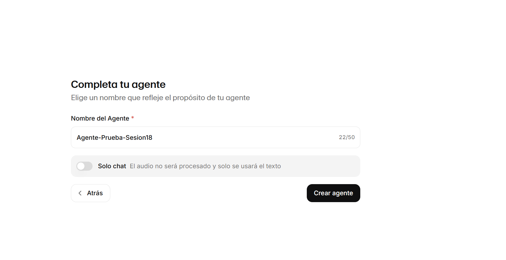

---

## Paso 5 y 6 — Editor del agente: system prompt, idioma y voz ✅

Este es el editor donde se configura casi todo el agente de una sola vista. Columna izquierda = comportamiento (prompt, primer mensaje); columna derecha = voz/idioma/LLM; panel derecho = probador en vivo.

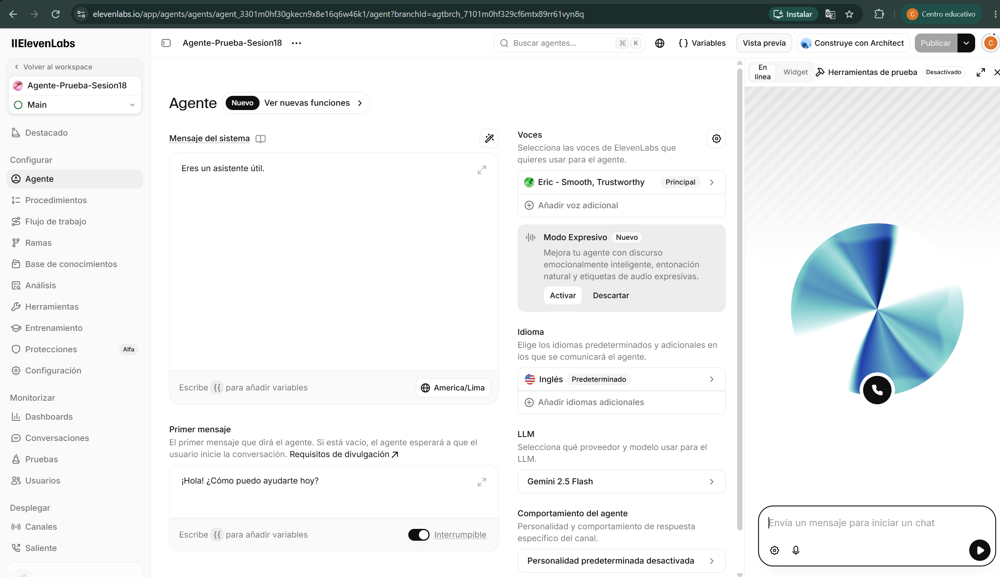

Qué hay que cambiar en esta pantalla (todavía en valores por defecto):

1. **Mensaje del sistema** (caja grande a la izquierda, ahora dice solo *"Eres un asistente útil."*) — bórralo y pega:
   ```
   Eres un asistente de voz breve y directo. Respondes en español,
   en oraciones cortas (una o dos frases), sin emojis ni markdown,
   porque tu respuesta se convierte a audio. Si el usuario pregunta
   por el clima de una ciudad, usa la herramienta get_clima.
   ```
   Nota: se piden respuestas cortas y sin formato porque el destino final es un sintetizador de voz (mismo detalle que señala el laboratorio de la sesión en `agent.py`).

2. **Idioma** (columna derecha, ahora dice *"Inglés — Predeterminado"*) — cambiarlo a **Español**, haciendo clic en esa tarjeta y seleccionándolo. Si no se cambia, el agente puede intentar responder o transcribir en inglés aunque le hables en español.

3. **Voces** (columna derecha, ahora tiene *"Eric — Smooth, Trustworthy"*, una voz en inglés) — hacer clic y elegir una voz en español de la biblioteca de ElevenLabs. Anota el nombre de la voz que elijas, lo necesitas para el reporte de hallazgos.

4. **Primer mensaje** (ya dice *"¡Hola! ¿Cómo puedo ayudarte hoy?"*) — está bien en español, no hace falta tocarlo.

5. **LLM** (columna derecha, *"Gemini 2.5 Flash"*) — déjalo con el valor por defecto, no afecta el objetivo de la prueba.

Resultado final de estos dos pasos:

- **Mensaje del sistema:** el prompt de voz breve en español (con la instrucción de usar `get_clima`).
- **Voces:** cambiado de "Eric" (inglés) a **"Gaby — Natura & Casual"**, voz femenina en español latinoamericano ("Female Latin American Spanish voice..."). Al elegirla, ElevenLabs filtró automáticamente el listado por *Idioma: Spanish* y *Acento: Latinoamericano*.
- **Idioma:** cambiado de "Inglés" a **"Español — Predeterminado"**.
- **LLM:** se dejó en Gemini 2.5 Flash (valor por defecto).

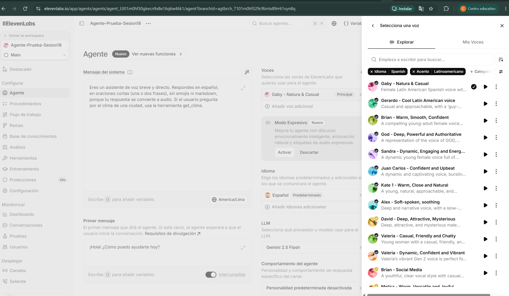

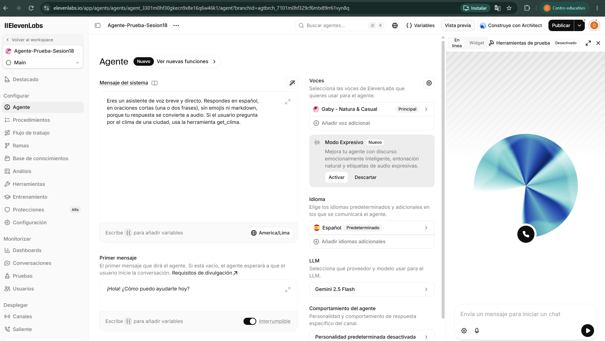

No hace falta pulsar "Publicar" todavía — primero configuramos la tool (Paso 7) y probamos con el panel derecho ("Vista previa"), que funciona sobre el borrador sin publicar.

---

## Paso 7 — Agregar una tool simulada ✅

Formulario completado en "Herramientas" (menú lateral) → "Añadir herramienta" → **Cliente**:
- **Nombre:** `get_clima`
- **Descripción de la tool:** *"Devuelve el clima actual de una ciudad. Úsala cuando el usuario pregunte por el clima."*
- **Parámetro:** `ciudad` (String, Requerido). El formulario pidió además una **descripción del parámetro** (*"Description cannot be empty"*) — ese campo es distinto al de la tool: le explica al LLM cómo reconocer la ciudad dentro de lo que diga el usuario, se completó con *"Nombre de la ciudad que menciona el usuario en la conversación."*
- **"Esperar respuesta"** activado, para que el agente espere el resultado antes de seguir hablando.

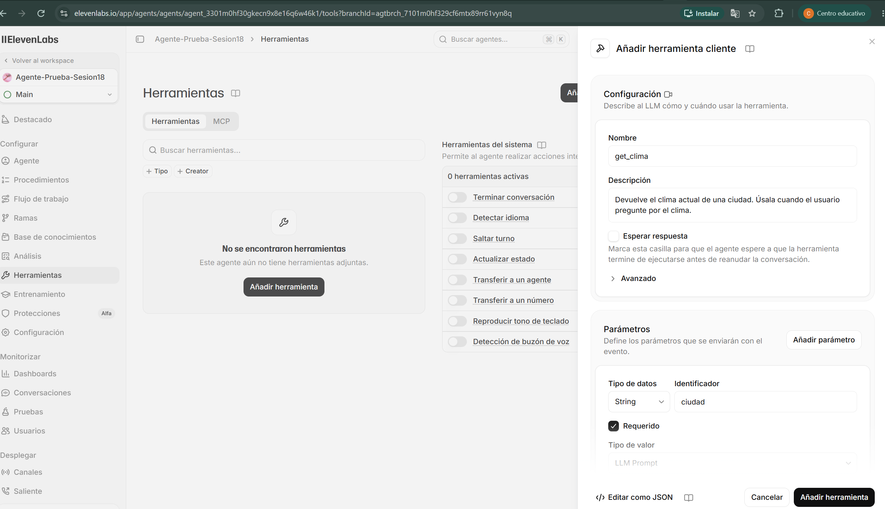

Tool guardada y ya aparece listada como **"get_clima — Herramienta de cliente"** dentro de las herramientas del agente:

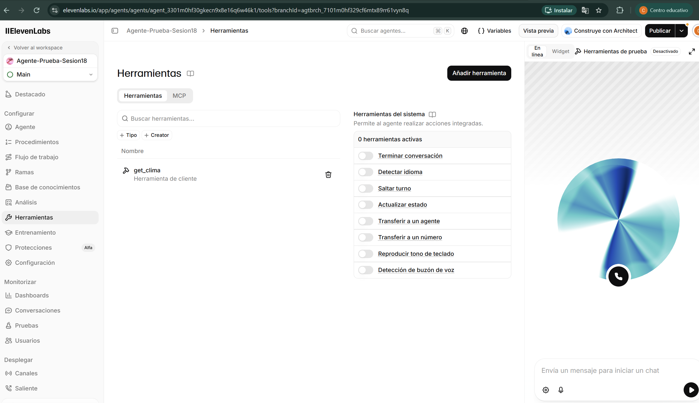

Esto reproduce el patrón `TOOL CALL` de las diapositivas 6-8 del material del curso: el LLM del agente, en medio de la conversación de voz, decide invocar una función cuando el contexto lo amerita.

**Nota importante (limitación esperada del tipo Cliente):** al ser una tool tipo *Cliente*, no tiene un campo de "respuesta fija" — se ejecuta del lado del cliente (tu app/navegador), no en un servidor de ElevenLabs. El valor simulado (`{"temperatura": "18°C", "condicion": "nublado"}`) se maneja recién en el **Paso 8**: cuando el agente invoque `get_clima` durante la conversación de prueba, el panel "Herramientas de prueba" (arriba a la derecha, ahora dice "Desactivado") debería mostrar el *tool call* y, si el free tier lo permite, dejarte devolver ese JSON manualmente. Si no lo permite, lo documentamos como limitación en los hallazgos y seguimos evaluando STT/TTS/latencia igual, sin necesidad de la tool.

---

## Paso 8 — Probar el agente ✅

**Primer intento — falló (como se esperaba):** con "Herramientas de prueba" activado pero sin una respuesta simulada configurada para `get_clima`, el agente sí invocó la tool, pero cayó en la "Estrategia de respaldo" = **"Finalizar con error"** (seleccionada, con borde negro, en la captura de abajo) y respondió *"No pude obtener el clima de Lima"*.

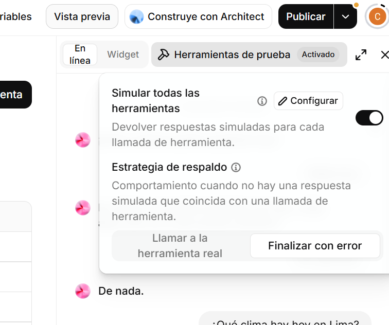

**Arreglo:** en el mismo panel, clic en **"Configurar"** (junto a "Simular todas las herramientas") → se abre la lista de tools → clic en `get_clima` ("1 respuesta simulada") → se define una **"Simulación 1"**: sin condición extra ("Siempre que se llame a la herramienta"), con "Devolver como error" desactivado, y el cuerpo de la respuesta simulada:

```json
{"temperatura": "18°C", "condicion": "nublado"}
```

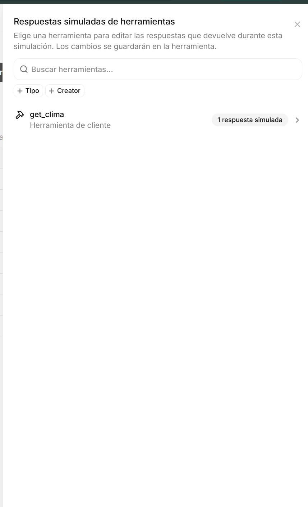

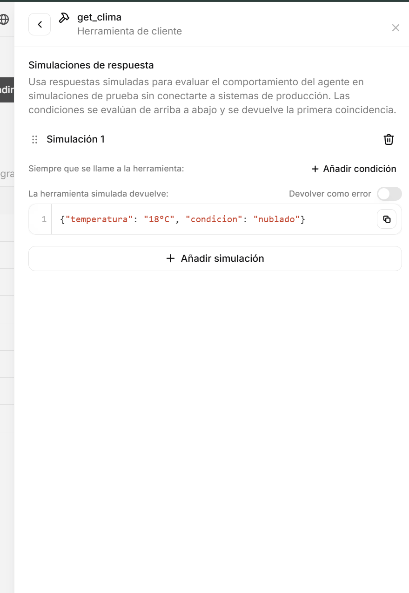

**Segundo intento — funcionó:** se inició una llamada real ("Llamada iniciada") por voz, con el micrófono del navegador. Transcripción de la prueba:

> **Usuario (voz):** "Hola, ¿cómo estás? ¿Cuál es el clima en Lima?"
> **Agente:** "El clima en Lima es nublado con una temperatura de dieciocho grados Celsius."
> **Usuario:** "Muchas gracias. Hasta luego."
> **Agente:** "De nada. ¡Hasta luego!"

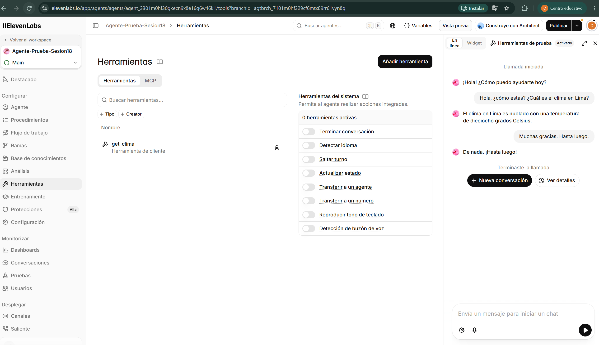

Esto confirma, de punta a punta, el patrón `TOOL CALL` de las diapositivas 6-8: el agente reconoció por voz la intención ("clima de Lima"), extrajo el parámetro `ciudad`, invocó `get_clima`, tomó la respuesta simulada y la verbalizó de forma natural — todo dentro de una llamada de voz real usando solo el micrófono/parlante de la laptop, sin cámara ni hardware adicional.

**Para el reporte de hallazgos (Paso 9), quedó registrado:**
- Latencia: conversación fluida, sin pausas largas perceptibles entre pregunta y respuesta.
- Tool calling: falla por defecto (con mensaje de error hablado) si no se configura una respuesta simulada por tool; una vez configurada, funciona correctamente. Vale la pena anotar como hallazgo que el free tier de ElevenLabs **sí** permite mockear respuestas por tool desde el propio dashboard, sin necesidad de un backend real — más flexible de lo que se anticipaba en el plan original.
- Voz: Gaby (español latinoamericano), sonó natural en la transcripción.
- El agente mantuvo el idioma español en toda la conversación (efecto del cambio del Paso 5/6).

---

## Paso 9 — Documentar hallazgos ⏳ próximo

Registrar en el `README.md` de esta carpeta o en el `ENTREGA_GOOGLE_DOC.md` final:
- Facilidad de configuración (¿cuánto tardaste en tener el agente funcionando?).
- Latencia observada.
- Calidad de voz y naturalidad.
- Comportamiento del *tool calling*.
- Límites del free tier (minutos/créditos usados).
- Comparación cualitativa con el enfoque *self-hosted* del laboratorio de la sesión (`fastrtc` + `moonshine` + `kokoro`): ¿qué ganas y qué pierdes usando SaaS?
- Aplicabilidad hipotética a un proyecto (sin necesidad de integración real): en qué escenario usarías esto.

---

## Checklist de cierre

- [x] Plataforma elegida (ElevenAgents).
- [x] Perfil de onboarding completado.
- [x] Agente en blanco creado con nombre y modo voz habilitado.
- [x] System prompt configurado.
- [x] Voz elegida (Gaby — Natura & Casual, español latinoamericano).
- [x] Tool simulada `get_clima` creada, con respuesta simulada configurada e invocada correctamente en una llamada real.
- [x] Agente probado por voz (llamada real con micrófono): saludo, pregunta de clima con tool call, cierre.
- [x] Hallazgos documentados (latencia, calidad, tool calling, límites del free tier) — en `ENTREGA_GOOGLE_DOC.md`.
- [x] Comparación SaaS vs. self-hosted redactada — en `ENTREGA_GOOGLE_DOC.md`.
- [x] Entregable final escrito en primera persona: `ENTREGA_GOOGLE_DOC.md` (esta carpeta).

---

*Guía de trabajo para la Tarea de la Sesión 18 — Módulo 6, basada en `Sesion18_InterfacesFisicas_ANALISIS_COMPLETO.md` (§6, §9). Capturas propias del proceso real de creación del agente.*
