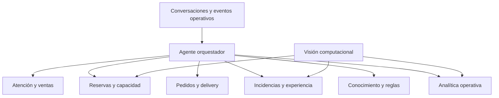

# Idea - Clemente para Restaurantes: Caso de Estudio

#idea

**Descripción**: alcance de estudio para analizar cómo Clemente puede conectar la atención conversacional con la operación diaria de un restaurante. Distingue lo que ya está resuelto de las oportunidades de mejora: delivery y recojo, gestión de incidencias, visión computacional y una arquitectura distribuida de agentes especializados.

**Estado**: Activa — alcance para análisis y priorización

---

## Contexto del negocio

Un restaurante necesita resolver cinco momentos: responder a quien consulta, convertir esa conversación en una reserva o compra, operar el servicio, resolver problemas y aprender de lo ocurrido.

Clemente busca conectar esos momentos en una sola plataforma conversacional y operativa.

## Problemas habituales

- Consultas que llegan por distintos canales y se responden tarde o de forma inconsistente.
- Reservas coordinadas manualmente, con riesgo de errores de capacidad o mesas.
- Personal sin contexto previo de cada cliente.
- Información sobre carta, horarios, condiciones o promociones que cambia y se desactualiza.
- Pedidos y solicitudes que se pierden entre chat, llamadas y atención presencial.
- Quejas o comentarios que se registran, pero no siempre se convierten en una tarea concreta.
- Poca visibilidad sobre ocupación real, tiempos de atención y rotación de mesas.

## Lo que Clemente ya permite resolver

| Necesidad | Cómo ayuda Clemente | Estado |
|---|---|---|
| Atención inicial | Responde conversaciones desde canales digitales y mantiene el contexto. | Resuelto |
| Reservas | Consulta disponibilidad, registra reservas y trabaja con zonas, mesas y combinaciones. | Resuelto |
| Conocimiento operativo | Centraliza FAQs, reglas y condiciones; los cambios pasan por validación antes de publicarse. | Resuelto |
| Perfil del cliente | Conserva historial e información útil para una atención más personalizada. | Resuelto |
| Feedback | Recoge comentarios y los convierte en información útil para la operación. | Resuelto |
| Gestión interna | Da visibilidad al equipo sobre reservas, mesas, solicitudes y estado operativo. | Resuelto |
| Pedidos | Aún no existe un flujo de pedidos orientado al negocio gastronómico. | Pendiente |

En conjunto, Clemente ya cubre una parte importante del ciclo: conversación, reserva, atención operativa y aprendizaje a partir de la relación con el cliente.

## Oportunidades de mejora

### Delivery y recojo en tienda

**Estado: pendiente.**

La plataforma podría incorporar un flujo completo de venta y fulfillment para que Clemente pueda:

- Tomar el pedido desde la conversación.
- Mostrar productos, extras y observaciones.
- Diferenciar delivery y recojo en tienda.
- Validar dirección, zona de reparto, costo y tiempo estimado.
- Gestionar pago, preparación, despacho y entrega.
- Informar al cliente sobre el estado del pedido.
- Alertar al equipo cuando haya retrasos o incidencias.

Esto permitiría que la plataforma no solo responda consultas, sino que genere y acompañe ventas de principio a fin.

### Seguimiento de incidencias

Una queja, demora o problema de reserva debería convertirse en un flujo claro:

`incidencia → responsable → plazo → solución → confirmación`

El objetivo es asegurar que los problemas no queden solo registrados, sino que terminen resueltos y comunicados al cliente.

### Conversión y recompra

Se puede fortalecer el seguimiento comercial para:

- Detectar conversaciones que no llegaron a reserva o pedido.
- Recuperar oportunidades cuando se libera disponibilidad.
- Reactivar a clientes según sus preferencias o visitas previas.
- Entender en qué momento se abandona una conversación.

## Visión computacional como extensión operativa

**Estado: propuesta pre-MVP.**

La visión computacional puede complementar a Clemente con información del espacio físico. En lugar de depender únicamente de lo que se registra manualmente, podría detectar eventos como:

- Mesa ocupada o liberada.
- Tiempo de permanencia de un grupo.
- Mesas sin atención durante demasiado tiempo.
- Diferencia entre una reserva registrada y la ocupación real.
- Rotación por zona, turno o tipo de mesa.
- Posibles combinaciones de mesas para grupos grandes.

La propuesta es procesar las cámaras localmente y enviar solo eventos operativos, no video continuo. Clemente recibiría señales como `mesa liberada`, `ocupación prolongada` o `grupo fuera del layout esperado`.

Las mesas y sus combinaciones deben seguir siendo datos declarados por la operación. La visión solo observa personas dentro de zonas ya configuradas; no debe inventar qué mesa existe ni modificar el plano automáticamente.

### Fases sugeridas

- [ ] Piloto de ocupación: cámaras, zonas configuradas, eventos de ocupada/libre y tablero en vivo.
- [ ] Alertas operativas: mesa sin atención, permanencia alta y diferencia entre reserva y ocupación.
- [ ] Combinaciones y layouts: sugerencias con aprobación humana.
- [ ] Analítica avanzada: rotación, demanda, circulación y recomendación de personal.

No se recomienda iniciar con reconocimiento facial ni identificación individual persistente del personal. Aumenta la complejidad y sensibilidad de datos sin ser necesario para validar el valor inicial.

## Propuesta tentativa: sistema distribuido de agentes

Actualmente existe una base para enrutar una conversación hacia un agente ejecutor. La siguiente evolución sería construir agentes especializados, coordinados por un orquestador.

### Responsabilidades propuestas

- **Atención y ventas:** responder, orientar y convertir.
- **Reservas y capacidad:** gestionar disponibilidad, mesas y lista de espera.
- **Pedidos:** procesar delivery y recojo cuando ese flujo exista.
- **Incidencias:** organizar problemas y coordinar su cierre.
- **Conocimiento:** mantener información correcta y actualizada.
- **Analítica:** detectar patrones de demanda, feedback, ocupación y conversión.
- **Orquestador:** decidir quién debe actuar y mantener el contexto.

Todos los agentes deben consultar y actualizar el mismo estado de clientes, reservas, mesas, pedidos e incidencias. Cada acción debe tener permisos limitados, evitar duplicados y dejar trazabilidad.

### Implementación gradual

- [ ] Mantener un agente principal y registrar intención, derivaciones y acciones.
- [ ] Separar primero las responsabilidades de reservas/capacidad y pedidos/fulfillment.
- [ ] Añadir agentes asíncronos para feedback, conocimiento y analítica.
- [ ] Conectar visión computacional como fuente de eventos, inicialmente solo para alertar.
- [ ] Permitir automatización únicamente cuando haya métricas, controles y aprobación humana definidos.

## Alcance propuesto para el equipo de estudio

1. Consolidar lo ya resuelto: atención, reservas, conocimiento, feedback y operación.
2. Diseñar el flujo completo de delivery y recojo como una capacidad pendiente.
3. Crear un sistema de incidencias con responsables y seguimiento.
4. Probar visión computacional como fuente de eventos de ocupación.
5. Evolucionar de un agente generalista a agentes especializados, empezando por reservas y pedidos.

La oportunidad principal es convertir a Clemente en una plataforma que conecte la conversación digital con lo que realmente ocurre en la operación: demanda, reservas, pedidos, mesas, atención y fidelización.

## Factibilidad y riesgos

La evolución es factible de manera gradual porque las capacidades actuales ya cubren conversación, reservas, información operativa y gestión de mesas. Los principales riesgos están en definir responsables operativos, calidad de los datos, permisos de cada agente, integración de pagos y logística para pedidos, y la precisión y privacidad del piloto de visión.

La recomendación es validar primero cada nueva línea como apoyo a la operación antes de automatizar acciones irreversibles.
